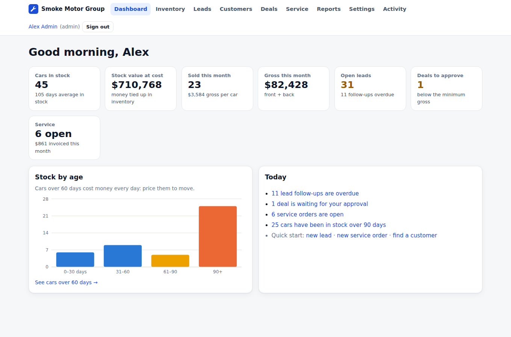
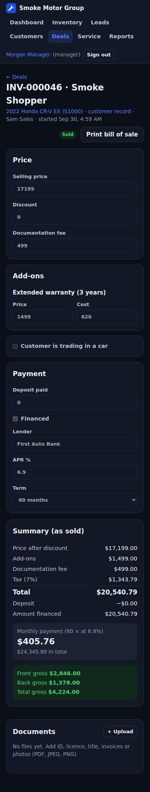

# Dealer Management System

One app to run a car dealership group: **inventory, CRM, sales deals, service, documents and reports**, with logins for each role. Built on PostgreSQL, so it is safe to use with many staff and several branches at once.

**Project guide (PDF):** [docs/PROJECT-GUIDE.pdf](docs/PROJECT-GUIDE.pdf) explains what this project is, the business problem it solves, the client's requirements, and how to build it from scratch, step by step.



## What it does

| Area | What staff can do |
|---|---|
| **Inventory** | Stock per branch with purchase cost, reconditioning and transport costs, list price, margin and days in stock. Aging view (30 / 60 / 90+ days). CSV export |
| **Leads (CRM)** | A pipeline board (New → Contacted → Appointment → Negotiation), sources, assigned salesperson, follow-up dates with overdue warnings, and a timeline of calls, emails and test drives |
| **Customers** | One record per customer with their leads, cars bought, service history and files |
| **Deals** | A pricing worksheet: discount, F&I products, trade-in with loan payoff, tax (with or without trade-in credit), documentation fee, deposit and finance with the monthly payment. Totals update as you type |
| **Approvals** | Deals below the minimum gross go to a manager, who approves them or sends them back with a reason |
| **Closing** | The car is marked sold (it can never be sold twice), the trade-in goes into stock at its appraised value, the lead is marked won, and a gapless invoice number is issued. A printable bill of sale |
| **Service** | Repair orders for customer cars with labour and parts, tax and a service invoice. **Reconditioning** orders for stock cars post their cost onto the car |
| **Documents** | Attach ID, licences, titles, invoices and photos (PDF, JPEG, PNG, WebP; checked by content, 5 MB max) to customers, cars and deals |
| **Reports** | Monthly units and front/back gross, gross per car, salesperson and branch results, lead-source conversion, oldest stock, service revenue, and a deals CSV for Excel / Power BI |

### Roles

| Role | Access |
|---|---|
| **Sales** | Leads, customers, deals (create, submit, close approved ones). **Doesn't see vehicle costs or gross**; add-on costs and trade-in appraisals are set by management, so a deal can't be made to look profitable enough to skip approval |
| **Service** | Repair orders and customers |
| **Manager** | Everything above plus stock, costs, approvals and reports |
| **Admin** | Also settings (tax, fees, minimum gross, F&I products, labour rate), branches, users and the activity log |



## Run it with Docker

```bash
cp .env.example .env              # set POSTGRES_PASSWORD, PUBLIC_URL and TIMEZONE
docker compose up -d --build
docker compose exec app node dist/cli/create-admin.js --email you@yourdealer.com --name "Your Name"
```

Open http://localhost:8080 and sign in. Under **Settings**, set tax, documentation fee, the minimum gross before approval, F&I products and branches, then add staff logins.

Demo data (two branches, six months of stock, leads, deals and service) is optional:

```bash
docker compose exec -e ALLOW_DEMO_SEED=1 app node dist/cli/seed-demo.js
# Logins: admin@demo.local, manager@demo.local, sales@demo.local, sales2@demo.local, service@demo.local
# Password: demo-password-1
```

## Development

Requirements: Node 22+ and PostgreSQL 14+.

```bash
npm install
cp .env.example .env    # set DATABASE_URL, NODE_ENV=development, COOKIE_SECURE=false
npm run migrate
npm run seed:demo       # optional
npm run dev             # API on :8080, app with hot reload on :5173
```

## Tests

```bash
npm run typecheck
npm test                        # deal and service maths, API integration tests on a real PostgreSQL, web helpers
npm run build && npm run smoke  # whole stack in Chromium: each role's day, from lead to sold car to service invoice
```

`TEST_DATABASE_URL` (default `…/dms_test`) and `SMOKE_DATABASE_URL` (default `…/dms_smoke`) are **dropped and recreated** on each run; the tests refuse to run unless the name contains `test` or `smoke`.

What the tests prove:

- **Money:** tax with and without trade-in credit, loan payoff, finance payments (checked against a standard amortisation table), front and back gross, trade-in over-allowance.
- **A car is sold once:** two salespeople submitting deals for the same car at the same moment: exactly one holds it. A closed deal can't be closed again; a sold car can't get new costs or a new deal.
- **Gapless numbers:** four deals closing at once get four consecutive invoice numbers.
- **Approvals can't be bypassed:** add-on costs come from the product list and trade-in values from a manager's appraisal, whatever a salesperson sends; thin deals need a manager; sending back needs a reason.
- **History is frozen:** a closed deal keeps its numbers when tax or fees change later.
- **Service:** labour and parts taxed per the settings; internal reconditioning posts its cost onto the car without tax; closed orders can't change.
- **Access:** every role sees only its areas (salespeople never receive cost or gross); every change needs a CSRF token; stale edits (two people on one record) are refused.
- **Documents:** only real PDFs and images are stored (a renamed program is refused), downloads are always attachments, 5 MB limit.
- **Reports add up:** the deals CSV matches the monthly report to the cent.

## Security

- **Accounts:** scrypt password hashes, lockout after 5 failures, `httpOnly` / `SameSite` / `Secure` session cookies with only a hash of the token stored, idle and absolute expiry, sign-out everywhere when a user is disabled or their password changes.
- **Requests:** CSRF token plus `Origin` check on every change, zod validation, parameterised SQL, rate limits, request size limits.
- **Headers:** strict Content-Security-Policy and related headers (Helmet).
- **Files:** type checked from content, safe file names, served only as downloads.
- **Audit log:** vehicles and prices, costs, deals (created, submitted, approved, sent back, closed, cancelled), service orders, documents, settings, users and logins.

## Operations

See [docs/OPERATIONS.md](docs/OPERATIONS.md) for deployment, https, backups, monitoring and upgrades.

## Known limits

- **No accounting ledger:** deals and service invoices export to CSV for your accounting package; there is no general ledger, VAT return or bank reconciliation.
- **No lender or DMV integrations:** finance is recorded and the payment calculated, but credit applications and title/registration paperwork are handled outside the app.
- **Unwinding a sold deal** isn't supported; record a correcting entry in your accounts and adjust stock manually.
- **Branches share one database view:** every user can see every branch's stock and customers (lists filter by branch).
- **Parts inventory** isn't tracked in stock; service parts are priced per order.
- **Rate limits are per server** (counted in memory, per app instance).
